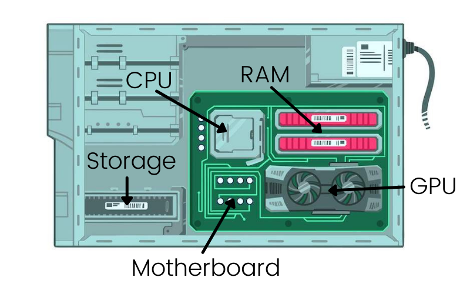
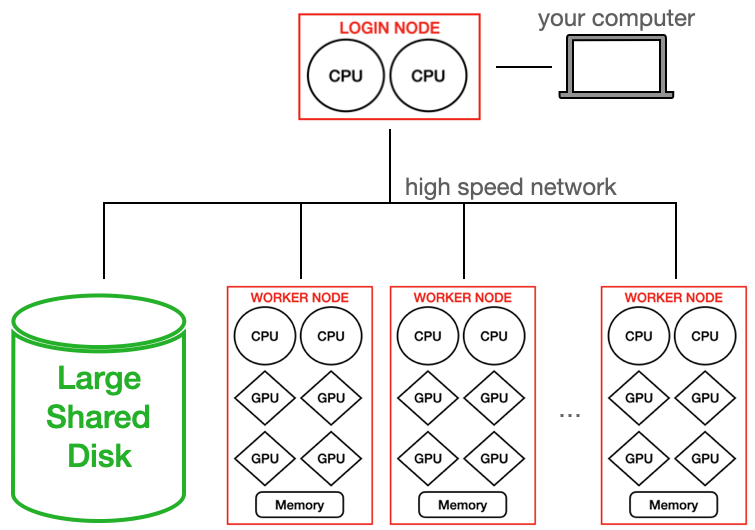

## [**⬅️ Back to Contents**](README.md)

 

# 00. What is HPC?

### TL;DR

**Estimated Time:** 10 minutes

**What you’ll learn:**

- What High-Performance Computing (HPC) is
- Why researchers use supercomputers
- How HPC systems differ from personal computers

**Why this matters for HPC:**

Everything in this Prep Pack is preparing you to work with the tools and workflows commonly used in scientific computing and HPC environments.

------

High-Performance Computing (**HPC**) is the use of powerful supercomputers to solve problems that would be too large, too complex, or take too long to run on a typical laptop.

Scientists and engineers use HPC systems to:

- Study climate and weather patterns
- Train artificial intelligence models
- Simulate materials and molecules
- Explore energy and scientific research challenges

------

 

## What Is a Supercomputer?

A supercomputer is not one giant computer.

Instead, it is typically made up of many individual computers working together.

Think of it like this:

**Your laptop can work on a problem using the hardware inside a single computer.**

**A supercomputer can use the hardware from thousands of computers working together.**

 

By dividing work across many computers, researchers can solve problems much faster than would be possible on a single laptop.

You'll learn more about how to access and utilize supercomputer resources during the bootcamp. For now, it's enough to know that tools like [Python](06-hpc-glossary.md#python), [Jupyter Notebooks](06-hpc-glossary.md#jupyter-notebook), and the [terminal](06-hpc-glossary.md#terminal) are commonly used throughout HPC workflows.

The rest of this Prep Pack will introduce these tools and help you become familiar with them before the bootcamp begins.

------

 

## ➡️ Next Lesson: [01. Python](01-python.md)