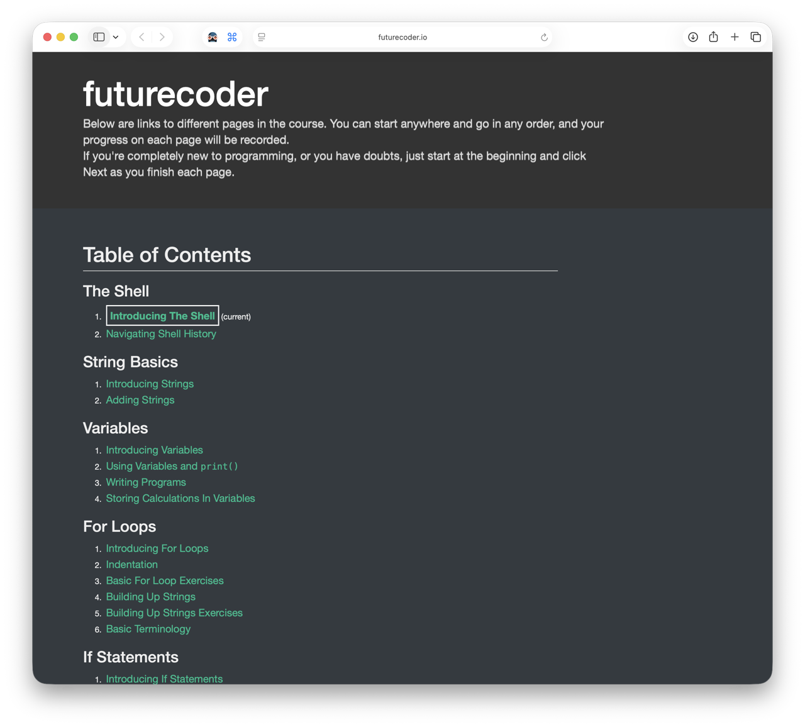

## [⬅️ Back to Contents](README.md) 

 

# 01. Python

#### TL;DR

**Estimated Time:** 1 hour

**What you'll learn:**
- Basic Python syntax
- How to run simple code
- How loops and functions work

**Why this matters for HPC:**

Python is commonly used to prepare data, run analysis, launch workflows, and work with scientific computing tools.

---

[futurecoder Interactive Python Tutorial](https://futurecoder.io/course/#toc)

Python is one of the most widely used programming languages in science, engineering, [machine learning](06-hpc-glossary.md#machine-learning), and high-performance computing. Many of the bootcamp projects use Python in some form, so becoming comfortable with the basics will make everything else feel much easier.

The FutureCoder lessons are interactive, browser-based, and beginner-friendly. They allow you to experiment with code directly in your web browser without installing anything.

If you get stuck, don’t worry. The built-in **Hints and Solutions** are there to help and are encouraged.

Start with: [Introducing The Shell](https://futurecoder.io/course/#IntroducingTheShell) 

From there, work through the lessons until you reach the end of the **For Loops** section.

You’re welcome to continue beyond that if you’re having fun, but completing through For Loops will provide a great foundation for the bootcamp.

---

 

## Libraries and Packages

One of Python’s biggest strengths is its ecosystem of libraries and packages.

A **library** (sometimes called a package) is a collection of code written by other people that you can reuse in your own programs. Instead of solving every problem from scratch, you can import a library that already provides the functionality you need.

For example:

- Need to work with large [datasets](06-hpc-glossary.md#dataset)? There’s a library for that.
- Need to create graphs and visualizations? There’s a library for that.
- Need to train an AI model? There’s a library for that too!

Different bootcamp projects use different libraries, and you do **not** need to become an expert in any of them before arriving.

For now, it’s enough to know that these tools exist and that Python’s library ecosystem is one of the reasons it is so popular.

If you’d like to learn more about some of the most common libraries used throughout the bootcamp, check out:

➡️ [**Python Libraries & Packages**](01b-python-libraries-packages.md)

---

 

### Explore Further (Optional)

Python is widely used in machine learning, artificial intelligence, and data science.

If you’re curious about how some of these libraries come together in practice, Kaggle provides an excellent beginner-friendly introduction.

**Optional Tutorial**

- https://www.kaggle.com/learn/intro-to-machine-learning

---

 

## ➡️ Next Lesson: [02. Jupyter Notebooks](02-jupyter.md)

