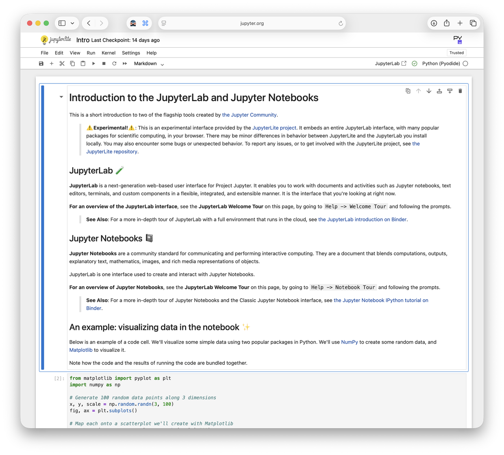
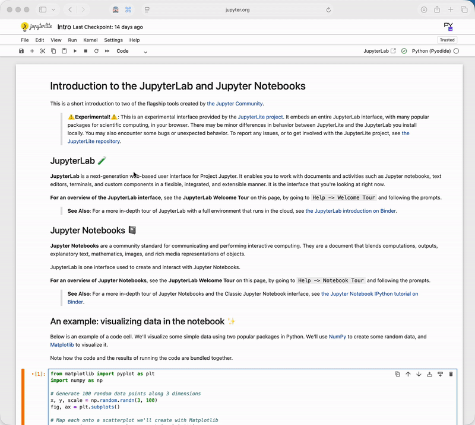
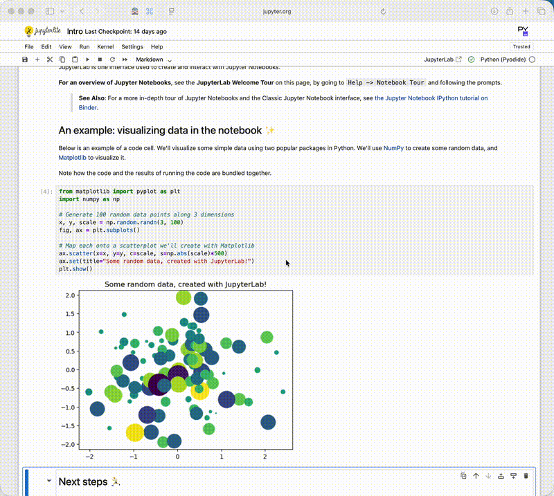
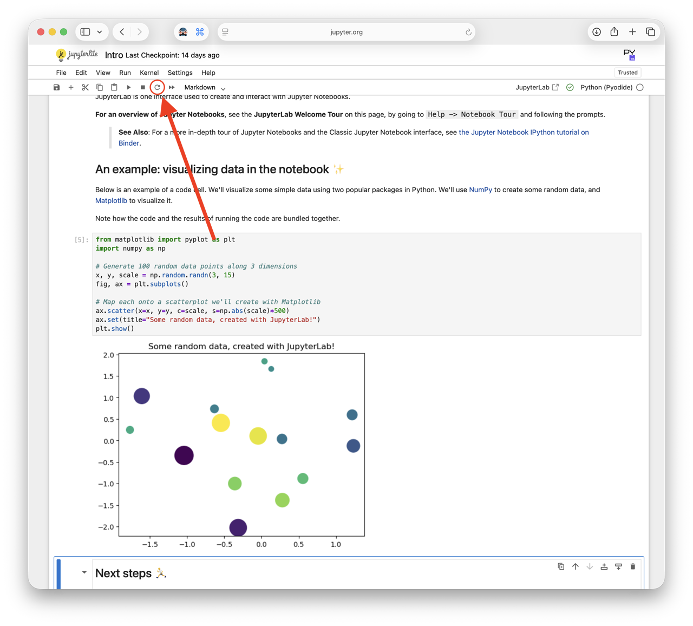

## [⬅️ Back to Contents](README.md) 

 

# 02. Jupyter Notebooks

#### TL;DR

**Estimated Time:** 30 minutes

**What you’ll learn:**

- What a Jupyter Notebook is
- How to run and edit notebook cells
- Common notebook shortcuts
- How to troubleshoot simple notebook issues

**Why this matters for HPC:**

Many bootcamp projects use Jupyter Notebooks to share code, lessons, visualizations, and scientific workflows. Becoming comfortable with notebooks will make it much easier to follow project materials and experiment with code.

---

Many bootcamp projects will use **Jupyter Notebooks** as their primary interface.

A Jupyter Notebook combines:

- Code
- Text
- Images
- Charts
- Documentation

all in a single interactive document.

Think of it as a laboratory notebook for computing. Instead of writing notes on paper, you write notes, code, and results together in one place.

**What is the difference between Python and Jupyter?**

[Python](06-hpc-glossary.md#python) is a programming language.

Jupyter Notebook is a tool for writing and running Python code interactively.

Think of it like:

- Python = the language
- Jupyter = the notebook you write it in

The good news is that you do **not** need to know how to create a notebook from scratch. Most project leads will provide notebooks for you. Your goal is simply to become comfortable opening a notebook, running code, and making small changes.

---

 

### Open a Notebook

<!-- TODO: Screenshot of Try Jupyter landing page -->

Visit:

https://jupyter.org/try-jupyter/notebooks/?path=notebooks/Intro.ipynb

This launches a Jupyter Notebook directly in your browser. No installation required.

### Five Things to Try

**1. Click on a Cell**

Notice that each block of text or code is contained inside a **cell**.

A cell is the basic building block of a notebook.

**2. Run a Cell**

Click inside a code cell and press:

`Shift + Enter`

This executes the code and moves to the next cell.

You will use this shortcut constantly during bootcamp.

<!-- TODO: GIF showing Shift+Enter executing a cell -->

**3. Change Something**

Find the plotting example in the notebook and change one of the numbers.

Then run the cell again and notice how the output changes.

Congratulations! You just edited and executed code.

<!-- TODO: GIF showing changed plot -->

**4. Run Cells in Order**

Notebooks remember information from previous cells.

Try running a cell near the bottom of the notebook before running the cells above it.

Sometimes you'll get an error.

This happens because notebooks execute sequentially and later cells often depend on earlier cells.

When in doubt: **Run cells from top to bottom.**

**5. Restart the Kernel**

A **[kernel](06-hpc-glossary.md#kernel)** is the program that actually runs your code.

Think of it as the notebook's engine.

If something seems broken or out of sync, restarting the kernel often fixes the issue.

You don't need to fully understand kernels yet. Just know that every notebook has one.

<!-- TODO: Screenshot of Restart the Kernal Button -->

---

 

### Important Jupyter Shortcuts

| Shortcut      | Action                   |
| ------------- | ------------------------ |
| Shift + Enter | Run current cell         |
| Enter         | Edit a cell              |
| Esc           | Exit editing mode        |
| A             | Create cell above        |
| B             | Create cell below        |
| M             | Convert cell to Markdown |
| Y             | Convert cell to Code     |

Don't worry about memorizing these. You'll pick them up naturally during bootcamp.

---

 

### Common Beginner Mistakes

**"Nothing happened."**

Make sure you actually ran the cell using `Shift + Enter`.

**"This worked earlier but now it doesn't."**

Try running the notebook from top to bottom again.

**"I got a NameError."**

A previous cell probably hasn't been run yet.

**"Everything is broken."**

Restart the kernel and run all cells again.

This fixes more problems than you'd think.

---

 

### Explore Further (Optional)

[Google Colab](06-hpc-glossary.md#google-colab) is a browser-based notebook environment built on many of the same ideas as Jupyter.

If you'd like more examples, check out:

- Google Colab [Python Skills](https://colab.research.google.com/github/cs231n/cs231n.github.io/blob/master/python-colab.ipynb#scrollTo=7DmKVUFaL9gQ)
- Google Colab: [Numpy](https://colab.research.google.com/github/amanchadha/aman-ai/blob/master/numpy.ipynb#scrollTo=y1LvV56hB0PS)
- Google Colab: [Matplotlib](https://colab.research.google.com/github/amanchadha/aman-ai/blob/master/matplotlib.ipynb)
- Google Colab: [Pandas ](https://colab.research.google.com/drive/1a4sbKG7jOJGn4oeonQPA8XjJm7OYgcdX)
- Google Colab: [Tensorflow](https://colab.research.google.com/github/amanchadha/aman-ai/blob/master/tensorflow.ipynb)
- Google Colab: [Pytorch](https://colab.research.google.com/github/amanchadha/aman-ai/blob/master/pytorch.ipynb)

---

 

## ➡️ Next Lesson: [03. CLI/Shell](03-cli-shell.md)

