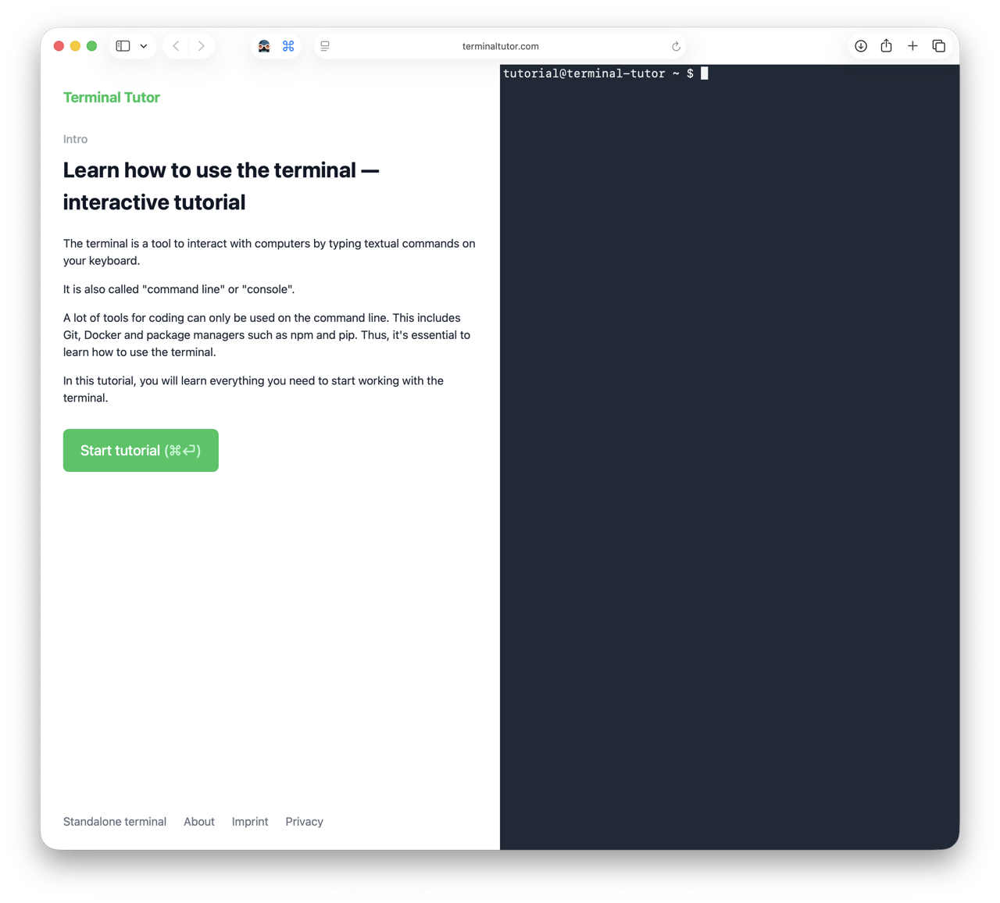
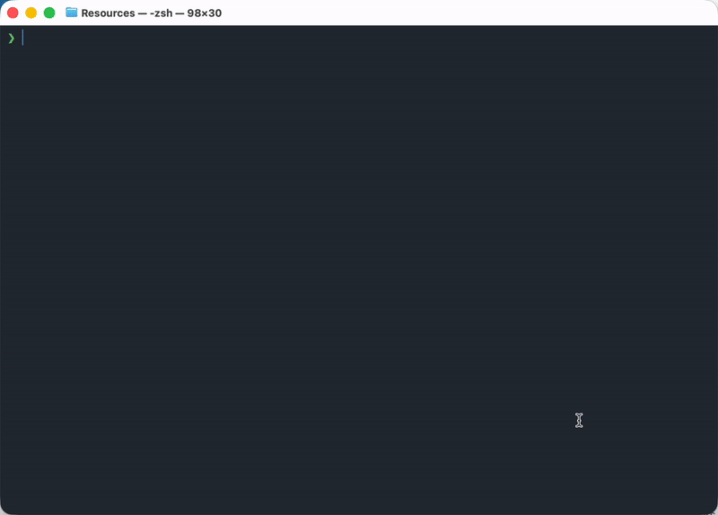

## [⬅️ Back to Contents](README.md) 

<br>

# 03. CLI / Shell

#### TL;DR

**Estimated Time:** 1 hour

**What you’ll learn:**

- How to navigate files and folders from the command line
- Common terminal commands
- How to connect to remote systems
- Basic command-line troubleshooting

**Why this matters for HPC:**

Most HPC systems are accessed through a terminal. Learning a few basic command-line skills will make it much easier to connect to computing resources, manage files, and follow project instructions during the bootcamp.

---

[Terminal Tutor](https://www.terminaltutor.com)

<!-- TODO: Screenshot of Terminal Tutor interface -->



The **Command Line Interface (CLI)**, often called the **shell** or **terminal**, is a text-based way of interacting with a computer.

Instead of clicking buttons and folders with a mouse, you type commands to navigate files, launch programs, move data, and connect to remote systems.

If you’ve never used a terminal before, don’t worry. Nearly everyone arrives at the bootcamp with different levels of experience, and many participants are seeing the shell for the very first time.

Terminal Tutor is a fantastic interactive resource that runs entirely in your browser and teaches the fundamentals through hands-on practice.

Work through the lessons until you feel comfortable with:

- Viewing files and folders
- Navigating directories
- Creating folders
- Moving files
- Running simple commands

You do **not** need to memorize every command. The goal is simply to become comfortable seeing a terminal window and typing commands into it.

---

<br>

### **Common Commands You’ll See**

You may encounter some of these commands during the bootcamp:

| **Command** | **What It Does**                    |
| ----------- | ----------------------------------- |
| `pwd`       | Shows your current location         |
| `ls`        | Lists files and folders             |
| `cd`        | Changes directories                 |
| `mkdir`     | Creates a new folder                |
| `cp`        | Copies files                        |
| `mv`        | Moves or renames files              |
| `rm`        | Deletes files                       |
| `cat`       | Displays a file’s contents          |
| `ssh`       | Connects to a remote system         |
| `history`   | Shows previously entered commands   |
| `Ctrl + C`  | Stops the currently running command |

<!-- TODO: GIF demonstrating pwd, ls, and cd -->



Don’t worry if these look unfamiliar right now. You’ll see them again throughout the bootcamp.

---

<br>

### A Quick Note About HPC

One of the first things you’ll do during the bootcamp is connect to a remote computing system.

Unlike a personal laptop, HPC systems are often accessed through a terminal session using a command called:

```bash
ssh
```

This may feel strange at first, but by the end of the week you’ll likely be navigating remote systems like you’ve been doing it for years.

---

<br>

### Common Beginner Mistakes

**“I typed a command and got an error.”**

This happens to everyone. Computers are very literal and even a small typo can change the meaning of a command.

**“I don’t know where I am.”**

Try:

```bash
pwd
```

This displays your current location.

**“I can’t find my files.”**

Try:

```bash
ls
```

This lists the files and folders in your current directory.

**“The terminal seems frozen.”**

Try pressing:

```text
Ctrl + C
```

This stops the currently running command and is one of the most useful keyboard shortcuts you’ll learn.

---

<br>

### **Explore Further (Optional)**

If you find yourself enjoying the shell, here are some excellent resources that go beyond the basics.

#### **OverTheWire: Bandit**

A capture-the-flag style game that teaches [Linux](06-hpc-glossary.md#linux) and shell skills through progressively harder challenges.

https://overthewire.org/wargames/bandit/

#### **Software Carpentry: The Unix Shell**

A more traditional lesson that covers shell fundamentals used in scientific computing.

https://swcarpentry.github.io/shell-novice/

#### **MIT Missing Semester: The Shell**

A fantastic lecture series covering practical computing skills often missing from traditional coursework.

https://missing.csail.mit.edu/2020/course-shell/

---

<br>

## ➡️ Next Lesson: [04. Git & Github](04-git-github.md)

