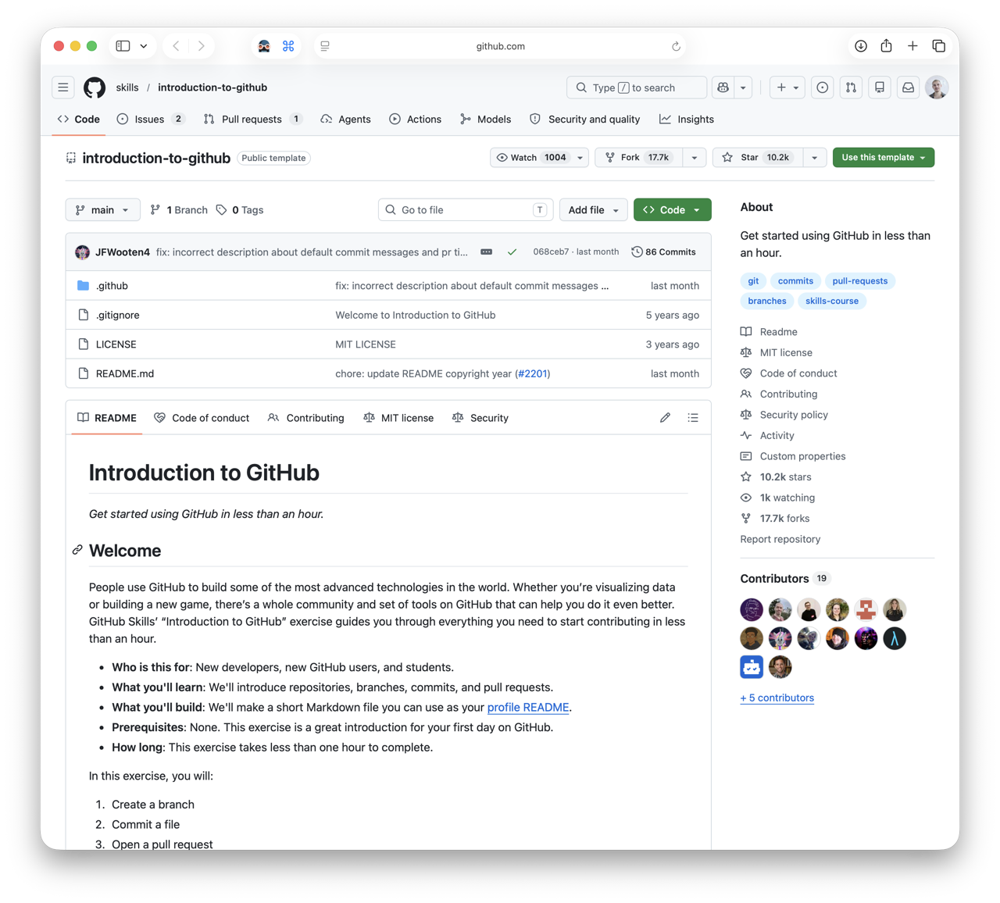

## [⬅️ Back to Contents](README.md) 

<br>

# 04. Git & GitHub

#### TL;DR

**Estimated Time:** 30 minutes

**What you’ll learn:**

- What Git and GitHub are
- How projects are organized on GitHub
- Common collaboration terms such as repositories, commits, branches, and pull requests
- The basics of version control

**Why this matters for HPC:**

Many bootcamp projects use GitHub to share code, [notebooks](06-hpc-glossary.md#jupyter-notebook), documentation, and project resources. Understanding the basics will make it easier to access project materials and collaborate with your teammates.

---

[GitHub Skills: Introduction to GitHub](https://github.com/skills/introduction-to-github)

[](https://github.com/skills/introduction-to-github)

Most bootcamp projects will use **GitHub** to share code, notebooks, [datasets](06-hpc-glossary.md#dataset), documentation, and project resources.

Before the bootcamp begins, we’d like you to become familiar with the basics of navigating GitHub and understanding how collaborative software projects are organized.

You’ll need to create a free GitHub account (or log into an existing one) before starting the lesson.

The GitHub Skills lessons are interactive, beginner-friendly, and feature a cute sidekick that guides you through the exercises.

The lesson introduces several concepts you’ll encounter during the bootcamp:

- Repositories
- Branches
- Commits
- Pull Requests

Don’t worry if these terms feel unfamiliar at first. By the end of the tutorial, you’ll have seen each of them in action.

---

<br>

### Git vs. GitHub

These two terms are often used together, but they’re *not* the same thing.

**Git** is a version control system.

It keeps track of changes to files over time and allows multiple people to collaborate on the same project without constantly emailing files back and forth.

If you’ve ever named a file:

```text
Final.docx
Final_v2.docx
Final_v2_final.docx
Final_v2_REALLY_FINAL.docx
```

you’ve already experienced the problem Git was invented to solve.

**GitHub** is a website built around Git.

It provides a place to store [repositories](06-hpc-glossary.md#repository-repo) online, collaborate with teammates, track issues, review code, and manage projects. We're in a repo, right now!

You **don’t** need to understand every detail of Git before the bootcamp. We simply want you to recognize the tools and basic workflow.

---

<br>

### **Explore Further (Optional)**

If you’d like to learn more before the bootcamp, GitHub offers several additional interactive lessons.

- Git Skills Directory: https://learn.github.com/skills
- Introduction to Git: https://github.com/skills/introduction-to-git
- Review Pull Requests: https://github.com/skills/review-pull-requests
- Resolve Merge Conflicts: https://github.com/skills/resolve-merge-conflicts

---

<br>

## ➡️ [05. Cheat Sheets](05-cheatsheets.md)


