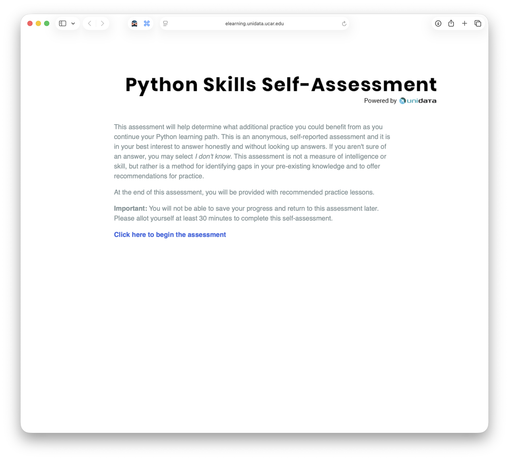

# Bootcamp Prep Pack

Hello!

This Prep Pack is designed to help you get comfortable with some of the tools and concepts you’ll encounter during the Intro to HPC Bootcamp. Participants come from many different backgrounds and experience levels, so don’t worry if some of these topics are completely new to you.

The goal is **not** to become an expert before the bootcamp.

The goal is simply to become familiar enough with the tools that when someone says “open a Jupyter notebook,” “clone a GitHub repository,” or “run this command in the terminal,” you’ll think: “Hey! I’ve seen that before.”

Explore as much or as little as you need. If you’re already comfortable with a topic, feel free to skim it. If something is brand new, take your time and don’t be afraid to use hints or solutions.

Most importantly: **you belong here, even if you’re a complete beginner.**

 

#### [Watch The Intro Video!](https://youtu.be/OMvCEszGgq8)

 

> If you have any questions, suggestions, or run into any issues, feel free to contact Rene at <rmontelongo@anl.gov>.

---

 

## Contents

#### Start Here

- [00. Pre-Assessment](#00-pre-assessment-start-here)
- [00. What Is HPC?](00-what-is-hpc.md)

#### Lessons

- [01. Python](01-python.md)
- [02. Jupyter Notebooks](02-jupyter.md)
- [03. CLI / Shell](03-cli-shell.md)
- [04. Git & GitHub](04-git-github.md)

#### Reference Material

- [05. Cheat Sheets](05-cheatsheets.md)
- [06. HPC Glossary](06-hpc-glossary.md)

---

 

## Quick Start Guide

Short on time? Here are the key resources in one place. For additional context and explanations, check out the lessons above.

1. [Complete the Python Self-Assessment](https://elearning.unidata.ucar.edu/metpy/PythonReadiness/selfassessment/)

2. [Work through FutureCoder from "Introducing the Shell" through the "For Loops" section](https://futurecoder.io/course/#toc)

3. [Open and interact with a Jupyter Notebook](https://jupyter.org/try-jupyter/notebooks/?path=notebooks/Intro.ipynb)

4. [Complete the Terminal Tutor lessons](https://www.terminaltutor.com)

5. [Complete GitHub Skills: Introduction to GitHub](https://github.com/skills/introduction-to-github)

---

 

## 00. Pre-Assessment [Start Here]

**Estimated Time:** 30 minutes

[Python Skills Self-Assessment](https://elearning.unidata.ucar.edu/metpy/PythonReadiness/selfassessment/)

This short assessment consists of 26 questions covering Python fundamentals, Jupyter notebooks, and common programming concepts.

The purpose is **not** to earn a high score.

Instead, think of it as a map. It can help identify areas where you already feel comfortable and areas where you may want a little extra practice before the bootcamp begins.

---

 

## ➡️ Next: [00. What Is HPC?](00-what-is-hpc.md) 
